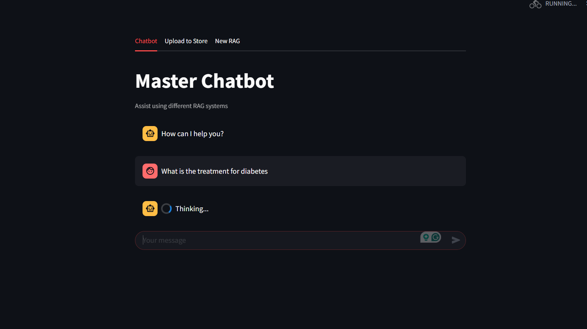
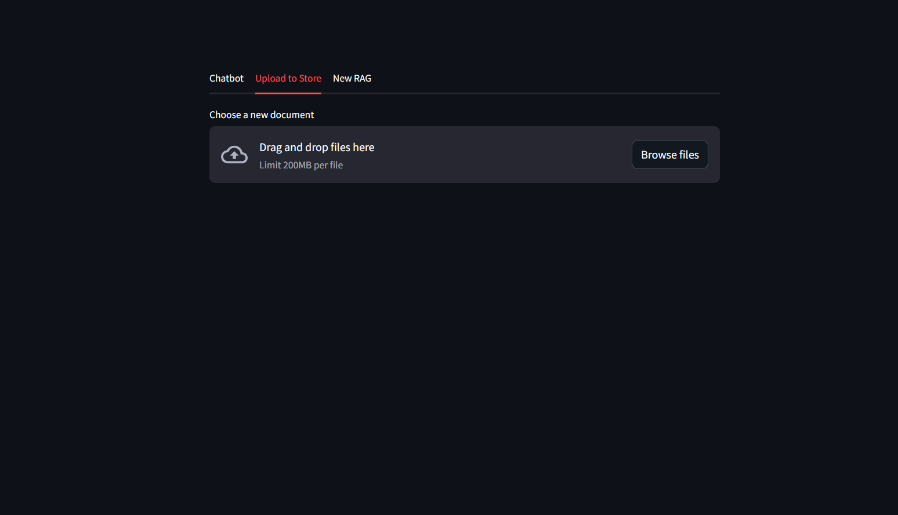
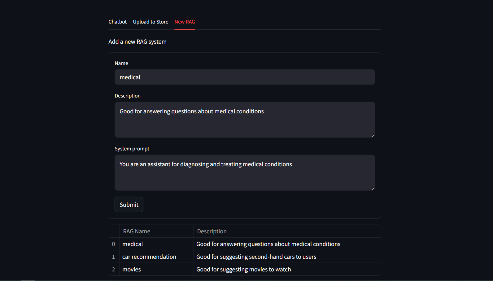

# 🧠 Master RAG
A RAG Hub that can host and provide all the users' RAG systems. These can be of various domains like medical, legal, educational, or general-purpose.

## 📝 Overview
**Master RAG** is a platform for hosting different RAG systems. Users can build and chat with their own custom RAG (Retrieval-Augmented Generation) pipelines. It works by letting users upload their own data, which is stored in a vector database, and then create a new RAG pipeline for that data.

It can also provide all of those hosted pipelines to anyone. Users can add a new pipeline, and others can use this pipeline when prompted according to it

The system uses **smart prompt understanding** to detect what the user needs and automatically switches to the correct RAG pipeline. This means users don’t have to manually choose or configure anything they can just start asking questions.

Master RAG uses both keyword and semantic search (hybrid search) to find the most useful information. It then feeds that information to a large language model (LLM), making responses more accurate and personalized.

This setup is perfect for anyone who wants to turn their data into a smart, chat-based assistant whether for documents, support, education, or more.

## 🚀 Features
✅ Add and manage custom data

✅ Add and manage new RAG pipeline

✅ Chat with different RAG systems via a unified interface

✅ Automatically switch between pipelines based on query content

✅ Pinecone-powered hybrid search

✅ Built with LangGraph for flexible, stateful RAG workflows

## 🛠️ Tech Stack
- **AI & NLP**: LangChain, HuggingFace, Google Generative AI  
- **Vector Search**: Pinecone  
- **Flow Logic**: LangGraph  
- **Frontend**: Streamlit  
- **Backend**: Python  
- **Dependency Management**: Poetry  

## 📸 UI Preview




## 🔧 Installation & Setup
### Prerequisites
- Python 3.X
- Poetry

### Steps
1. Clone the repository:
   ```bash
   git clone https://github.com/your-username/master-rag.git
   cd master-rag
   ```

2. Install dependencies:
   ```bash
   poetry install
   ```

3. Set up environment variables in a `.env` file (e.g., API keys for Pinecone, Google GenAI, etc.)

4. Launch the application:
   ```bash
   poetry run streamlit run app.py
   ```

## 📦 Dependencies
This project uses Poetry for dependency management. Major packages include:

```toml
[tool.poetry.dependencies]
langchain = ">=0.3.21,<0.4.0"
langchain-google-genai = ">=2.1.2,<3.0.0"
langchain-huggingface = ">=0.1.2,<0.2.0"
langchain-community = ">=0.3.20,<0.4.0"
langchain-text-splitters = ">=0.3.7,<0.4.0"
pinecone-text = ">=0.10.0,<0.11.0"
pinecone = { version = ">=6.0.2,<7.0.0", extras = ["grpc"] }
dotenv = ">=0.9.9,<0.10.0"
langgraph = ">=0.3.25,<0.4.0"
streamlit = ">=1.44.1,<2.0.0"
```

## 🤝 Contributing
Contributions are welcome! To get started:

1. Fork the repository  
2. Create a new branch (`git checkout -b feature-name`)  
3. Make your changes and commit (`git commit -m "Add feature"`)  
4. Push your branch (`git push origin feature-name`)  
5. Open a pull request

## 📜 License
This project is licensed under the MIT License. See the [LICENSE](LICENSE) file for more information.

## 📞 Contact
- **GitHub:** https://github.com/1tsZaid 
- **Email:** zaidasif011@example.com  
